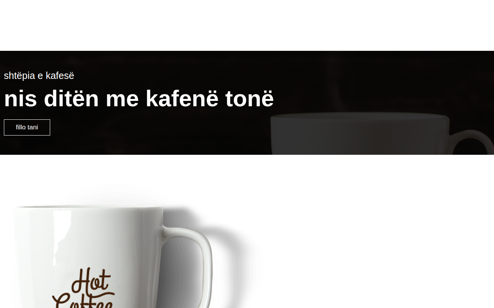

# Cafe-Website — Faqe moderne kafeneje

Një faqe moderne dhe responsive për kafene, me menu, galeri, seksion kontakti dhe blog — e përshtatur plotësisht në gjuhën shqipe.

**Demo live:** https://erionnezha.github.io/Cafe-Website/



## Përmbajtja

- **Ballina** — seksion hero me thirrje për veprim
- **Rreth nesh** — përshkrimi i kafenesë me pikat kryesore
- **Menua** — kartela me produktet e kafenesë
- **Galeria** — galeri fotosh me efekte hover
- **Kontakti** — telefoni, email, adresa, harta dhe formulari i kontaktit
- **Blogu** — postime demo
- **Buletini** — formulari i abonimit
- Formular hyrjeje (login) me dizajn modern

## Si hapet lokalisht

Nuk nevojitet asnjë server apo instalim — thjesht hapeni `index.html` në shfletues:

```bash
# opsioni 1: hapeni direkt
open index.html        # macOS
start index.html       # Windows
xdg-open index.html    # Linux

# opsioni 2: me server lokal
python3 -m http.server 8000
# pastaj hapeni http://localhost:8000 në shfletues
```

## Teknologjitë

- HTML5
- CSS3 (custom + Bootstrap 4.6.1)
- JavaScript (vanilla)
- Font Awesome 5.15.4 (ikonat)

## Licenca

Ky projekt është licencuar sipas licencës MIT — shihni file-in [LICENSE](LICENSE) për detaje.

---

# Cafe-Website — Modern café website

A modern, responsive café website with a menu, gallery, contact section and blog — fully localized in Albanian.

**Live demo:** https://erionnezha.github.io/Cafe-Website/


## Contents

- **Home** — hero section with a call to action
- **About** — café description with key highlights
- **Menu** — product cards
- **Gallery** — photo gallery with hover effects
- **Contact** — phone, email, address, map and contact form
- **Blog** — demo posts
- **Newsletter** — subscription form
- Login form with a modern design

## How to open locally

No server or installation needed — just open `index.html` in a browser:

```bash
# option 1: open directly
open index.html        # macOS
start index.html       # Windows
xdg-open index.html    # Linux

# option 2: with a local server
python3 -m http.server 8000
# then open http://localhost:8000 in your browser
```

## Technologies

- HTML5
- CSS3 (custom + Bootstrap 4.6.1)
- JavaScript (vanilla)
- Font Awesome 5.15.4 (icons)

## License

This project is licensed under the MIT License — see the [LICENSE](LICENSE) file for details.
